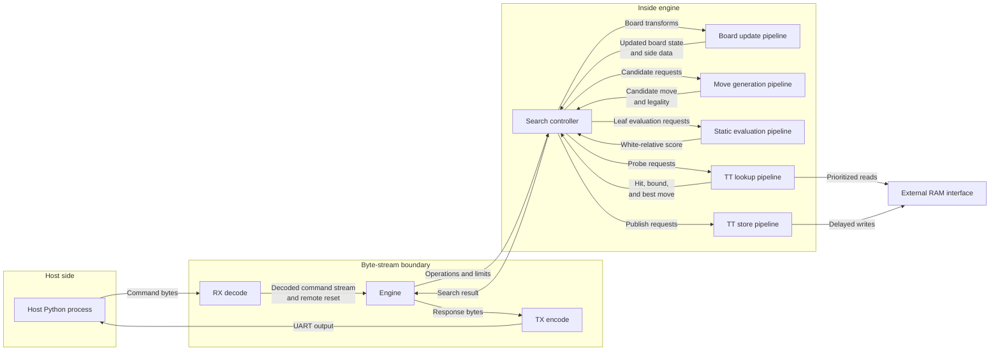

# Chip Design

The chip is a hardware chess engine controlled by a minimal host-side Python program. The host exposes UCI, validates and parses incoming positions and moves, logs activity, and translates UCI commands into a compact FPGA protocol. FPGA commands are assumed valid after host parsing.

The FPGA maintains the active game/search state between commands and performs the search work. Once a search command begins, the FPGA does not require further host communication until it finishes, except for in-band kill, UART BREAK remote reset, or output backpressure.

The internal design passes explicit board-state values through shared pipelines. A board position is represented as `FullBoard` plus side data such as a Zobrist key, incremental piece-square-table score, material information, search stack records, transposition-table metadata, and per-thread control state.

The design has a parameterized number of search threads and a parameterized search stack depth. Perft, Zobrist hashing, the transposition table, and incremental piece-square-table evaluation are core engine paths. The current controller defaults are `SEARCH_THREAD_COUNT = THREAD_COUNT` and `SEARCH_STACK_DEPTH = MAX_PLY_COUNT`, with `THREAD_COUNT = 8` and 32 plies in the multi-thread RTL tests.

## Major Blocks

| Block                      | Role                                                                                                                                        |
| -------------------------- | ------------------------------------------------------------------------------------------------------------------------------------------- |
| Host Python process        | Implements UCI, validates/parses positions and moves, logs activity, and communicates with the FPGA.                                        |
| RX decode                  | Converts UART input into command/data bytes, buffers them across the UART/engine clock boundary, and detects UART BREAK remote reset.       |
| TX encode                  | Converts FPGA output bytes into UART output and reports backpressure.                                                                       |
| Engine                     | Contains the command layer and search controller, receives host commands, maintains engine/search state, and returns results.               |
| Search controller          | Owns search threads, search stacks, alpha/beta state, pipeline dispatch, and result routing.                                                |
| Board update pipeline      | Applies push move, commit move, reverse move, and board setup operations.                                                                   |
| Move generation pipeline   | Produces one ordered candidate move per dispatch and reports whether that candidate is legal.                                               |
| Static evaluation pipeline | Computes White-relative full-position evaluation terms from a board-state input.                                                            |
| TT lookup pipeline         | Performs transposition-table lookup requests against external RAM and any internal cache.                                                   |
| TT store pipeline          | Performs transposition-table writes; stores may be stalled or deprioritized when memory bandwidth is needed by lookups.                     |
| External RAM interface     | Provides storage for the transposition table through a vendor-neutral wrapper around the selected SDRAM, DDR, or board memory interface.    |
| FPGA platform wrappers     | Isolate vendor-specific RAM, ROM, PLL, FIFO, UART, and external-memory IP so Intel/Altera and Xilinx builds can share the same logical RTL. |

## Search Pipelines

The five major search pipelines are board update, static evaluation, ordered move generation, TT lookup, and TT store.

Board update, static evaluation, and move generation are high-area pipelines kept busy with work from many search threads. Move generation is split into independent noisy/direct and quiet class pipelines. Each search thread has at most one in-flight request in each major component. This avoids duplicate work for the same thread position and lets pipeline results be routed by `thread_id` without a wider request ID.

Pipeline parallelism means different threads can occupy different stages of a pipeline at the same time, and different threads can concurrently use the noisy and quiet move-generation pipelines. It does not mean a single thread issues multiple simultaneous board updates, evaluations, or move-generation requests for the same active position.

The main pipelines are designed for throughput and can accept a new request each cycle when input work is available and downstream resources are not stalled. TT lookup/store throughput is limited by external memory bandwidth.

## State Ownership

The FPGA maintains active game state between commands. The host can send setup, make-move, new-game, perft, and search commands; the Python host is responsible for parsing and validating UCI inputs before encoding those commands.

Search owns per-thread state. Each thread keeps an active search stack and move records for reverse traversal rather than storing a full `FullBoard` at every ply. The board update pipeline transforms board states and move records but does not own the engine position.

Zobrist hashes and material plus piece-square-table evaluation are maintained incrementally by board update. The remainder of the static evaluation is fully computed by the static evaluation pipeline on dispatch.

Raw static evaluation and incremental PST/material state are White-relative. Search normalizes scores to point-of-view format at search boundaries. This keeps evaluation modules simple while allowing the search controller to use a conventional side-to-move alpha/beta convention.

## Transposition Table

The transposition table used to store previously computed information is required for Lazy SMP multithreading. The DE1 implementation stores the primary TT in its FPGA-side SDR SDRAM behind a vendor-neutral burst interface and uses a small direct-mapped BRAM cache. Other targets can connect a different memory controller to the same logical interface or retain the inferred-BRAM fallback.

TT lookups are more latency-sensitive than TT stores and receive priority when lookup/store bandwidth conflicts. Stores enter a parameterized best-effort frontend FIFO and drain opportunistically; overflow stores are dropped so memory pressure never blocks search after publication. Memory arbitration and FIFO depth are target parameters selected using measured search throughput.

## Vendor Support

The logical design is FPGA-vendor neutral. Vendor-specific resources are isolated behind wrappers or generated modules with stable logical interfaces. RAMs, FIFOs, external memory controllers, clocking, and board-level I/O support both Intel/Altera and Xilinx implementations.
