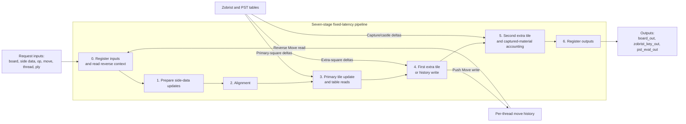

# Board Update Pipeline (`board_update_pipeline`)

The board update pipeline is a pipelined board-state transformer. It accepts a complete `FullBoard`, side data, and an operation, then outputs the transformed board and updated side data after fixed latency. It does not own long-term active board state.

## Ports

| Direction | Port Name | Description |
| --------- | --------- | ----------- |
| Input | `clk` | Clock. |
| Input | `board_op` | Operation code for what the board update pipeline should do. |
| Input | `board_in` | Input `FullBoard` state. |
| Input | `zobrist_key_in` | Input Zobrist key for the board position. |
| Input | `pst_eval_in` | Current White-relative piece-square-table evaluation. |
| Input | `move_in` | Move to apply for push/commit operations, or destination square for set-tile operations. |
| Input | `set_data` | Tile, turn, castle perms, en passant info, or halfmove clock depending on the set operation. This signal is 7 bits wide; narrow setup values use the low bits. |
| Input | `thread_id` | Search thread whose move-history record should be read or written. |
| Input | `search_ply` | Search ply before the current operation. |
| Output | `board_out` | Output `FullBoard` state. |
| Output | `zobrist_key_out` | Updated Zobrist key for the board position. |
| Output | `pst_eval_out` | Updated White-relative PST evaluation. |

## Operations

| Operation | Inputs Required | Description |
| --------- | --------------- | ----------- |
| Push Move | `move_in` | Makes a reversible search move and writes a move-history record. |
| Commit Move | `move_in` | Makes an irreversible active-game move without writing a search move-history record. |
| Set Tile | `move_in.to_pos`, `set_data` tile | Places a piece or `NULL_PIECE` on one square. |
| Set Turn | `set_data[0]` | Updates the side to move without changing tiles. |
| Set Castle Perms | `set_data[3:0]` | Updates castling permissions without changing tiles. |
| Set En Passant | `{ep_file[2:0], has_ep}` | Updates en passant state without changing tiles. |
| Set Halfmove Clock | `set_data[6:0]` | Updates the 50-move-rule halfmove clock without changing tiles. |
| Reverse Move | `thread_id`, `search_ply` | Reverses the previous pushed move for the thread. |
| Idle | None | Does nothing. |

## Pipeline

| Pipeline Stage | Description                                                               |
| -------------- | ------------------------------------------------------------------------- |
| 0              | Register inputs and fetch previous move data for reverse operations.      |
| 1              | Prepare side-data updates and preserve input context.                     |
| 2              | Alignment stage.                                                          |
| 3              | Compute primary tile updates and fetch Zobrist/PST data.                  |
| 4              | Update first extra tile for en passant or castling and write move record. |
| 5              | Update second extra tile for castling and account for captured material.  |
| 6              | Output board data, Zobrist key, and PST evaluation.                       |

## Board Setup

The final engine should set up a board by issuing explicit Set Tile, Set Turn, Set Castle Perms, Set En Passant, and Set Halfmove Clock operations, or by using a higher-level Set Board command that the engine layer decomposes into those operations. Resetting the board update pipeline should not be required to create a legal position.

## Hashing

Zobrist hashing is implemented with 64-bit keys. Tile, turn, castling, and en passant hash components are updated incrementally as part of board operations.

The Zobrist constants are generated from the same deterministic source into `hardware/data/zobrist/zobrist_values.hex` and `hardware/rtl/generated/zobrist_values_pkg.sv`. The board-update RTL reads the `.hex` data through four replicated synchronous true-dual-port ROMs, providing the eight simultaneous reads needed by the worst-case incremental hash update while preserving the existing seven-stage external pipeline latency. The portable ROM template carries Intel and Xilinx block-RAM inference hints; Quartus infers the DE1-SoC copies as M10K-backed ROMs. The generated SystemVerilog package remains a reference representation of the same data. Regenerate both files with `python hardware/scripts/generate_zobrist_values.py`; the generator uses deterministic SHA-256-derived candidates and accepts only nonzero unique values with balanced Hamming weight, minimum pairwise Hamming-distance checks, and a whole-table bit-balance check. Pawn entries on ranks 1 and 8 are intentionally zero because those pieces cannot occur in legal board states.

`ENABLE_ZOBRIST` defaults to enabled. With the parameter disabled, `zobrist_key_out` remains unchanged by hash-table lookups and the search controller must also disable TT traffic and repetition-draw detection.

`ENABLE_PST` defaults to enabled. With the parameter disabled, PST lookup values are zero and the pipeline still updates material deltas through `PIECE_VALS_128`.

## PST Tables

Piece-square-table constants are generated from `hardware/data/pst_values/pst_values.json` into `hardware/data/pst_values/pst_values.hex` and `hardware/rtl/generated/pst_values_pkg.sv`. Regenerate both files with `python hardware/scripts/generate_pst_values.py`; a separate `.mif` file is not required by the current portable RTL flow.

## Move History

Push Move writes enough data to reverse the move later, including origin, destination, captured piece, castling permissions, en passant state, halfmove clock, and special-move flag. Reverse Move reads the record for `thread_id` and `search_ply - 1`.

Each thread may have one reversible move per ply. Search must reverse all pushed moves before reusing that ply record for a different line.

