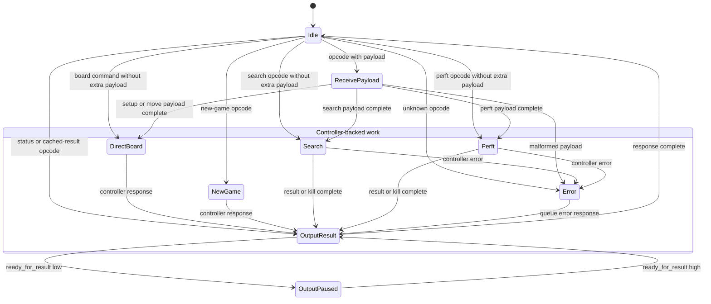

# Engine (`engine`)

The engine module is the complete vendor-neutral chess core between the RX/TX stream wrappers. It contains an `engine_command_layer` that parses fixed-size command payloads and streams responses, plus the `search_controller` that owns board and search state.

The typed `EngineControllerRequest` and `EngineControllerResponse` boundary is internal to `engine`. Board wrappers therefore do not know about controller operations.

## Ports

| Direction | Port Name | Size | Description |
| --------- | --------- | ---- | ----------- |
| Input | `clk` | 1 | Engine clock. |
| Input | `rst_n` | 1 | Synchronous active-low reset. |
| Input | `data_in` | 8 | Command or payload byte from RX decode. |
| Input | `data_in_valid` | 1 | Indicates `data_in` is valid. |
| Input | `ready_for_result` | 1 | Indicates the downstream output path can accept another result byte. |
| Output | `error_flag` | 1 | Indicates the engine has detected a protocol or internal error. |
| Output | `ready` | 1 | Indicates the engine can accept the next command or payload byte for its current input state. |
| Output | `data_out` | 8 | Response byte. |
| Output | `data_out_valid` | 1 | Indicates `data_out` is valid. |
| Input | `tt_memory_ready`, `tt_memory_error` | 1 each | Status of the selected TT memory backend. |
| Request/response | `tt_mem_*` | See `tt_defs.sv` | Vendor-neutral TT memory command, write-data, read-data, and completion channels. |

The engine parameters configure the 64-bit build ID, controller clock frequency, thread count, stack depth, unsigned-Q8 LMR constants `LMR_A_Q8` and `LMR_B_Q8`, whether the TT uses the external-memory backend, and whether optional search statistics are synthesized. `ENABLE_SEARCH_STATS = 0` removes the debug counters. Each board wrapper must set `BUILD_ID` to the identifier generated for that synthesized image and `CLOCK_FREQ` to the exact frequency driven on `clk`; clock generation and build-ID generation stay outside the portable core. The Get Build Information response is selected directly from these constant parameters and adds no metadata memory or search-path state.

## Commands

The engine command byte and payload formats are defined in [laptop-fpga-communication.md](../protocols/laptop-fpga-communication.md). The engine assumes command payloads are legal chess commands because the Python host validates UCI input before encoding FPGA commands.

The external protocol exposes `Set board` as a single fixed-size command. The engine decomposes it into multiple direct-board operations internally; this keeps host setup atomic and avoids command-stream overhead from 64 separate tile writes.

## States

| State           | Description                                                                                                 |
| --------------- | ----------------------------------------------------------------------------------------------------------- |
| Idle            | Engine is awaiting a command byte.                                                                          |
| Receive Payload | Engine is collecting the fixed-size payload for the current command.                                        |
| Direct Board    | Engine is applying setup or make-move operations through the search controller direct-board path.           |
| New Game        | Engine is clearing game/search state and resetting the active board to the normal starting position.        |
| Search          | Engine has started a search and waits for completion, kill, or error.                                       |
| Perft           | Engine has started a perft operation and waits for completion, kill, or error.                              |
| Output Result   | Engine is streaming a response one byte at a time.                                                          |
| Output Paused   | Engine has response bytes pending but `ready_for_result` is deasserted.                                     |
| Error           | Engine detected a malformed command, unsupported opcode, or internal error and will emit an error response. |

## New Game Semantics

The New Game command follows UCI `ucinewgame` semantics. It clears active search state, the compact TT, repetition/history state, latched errors, pending responses, and any command FIFO contents that can be safely discarded. It also resets the active board to the normal chess starting position.

## Child Modules

- `engine_command_layer`
- [`search_controller`](search-controller.md).
