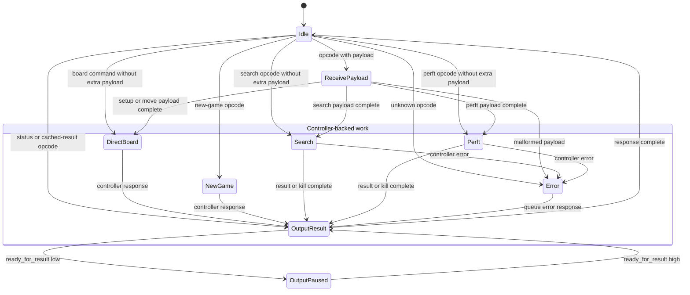

# Engine (`engine`)

Status: implemented V1 protocol FSM with an internal real search controller.

The engine module is the complete vendor-neutral chess core between the RX/TX stream wrappers. It contains an `engine_command_layer` that parses fixed-size command payloads and streams responses, plus the `search_controller` that owns board and search state.

The typed `EngineControllerRequest` and `EngineControllerResponse` boundary is internal to `engine`. Board wrappers therefore do not know about controller operations. The lightweight `search_controller_stub` remains available for focused command-layer tests only.

## Ports

| Direction | Port Name | Size | Description |
| --------- | --------- | ---- | ----------- |
| Input | `clk` | 1 | Engine clock. |
| Input | `rst_n` | 1 | Synchronous active-low reset. |
| Input | `data_in` | 8 | Command or payload byte from RX decode. |
| Input | `data_in_valid` | 1 | Indicates `data_in` is valid. |
| Input | `kill` | 1 | Asynchronous request to stop the current search. |
| Input | `ready_for_result` | 1 | Indicates the downstream output path can accept another result byte. |
| Output | `error_flag` | 1 | Indicates the engine has detected a protocol or internal error. |
| Output | `ready` | 1 | Indicates the engine can accept the next command or payload byte for its current input state. |
| Output | `data_out` | 8 | Response byte. |
| Output | `data_out_valid` | 1 | Indicates `data_out` is valid. |

The engine parameters configure the internal controller clock frequency, thread count, stack depth, perft support, Zobrist hashing, transposition table, and piece-square tables.

## Commands

The engine command byte and payload formats are defined in [laptop-fpga-communication.md](../protocols/laptop-fpga-communication.md). The engine assumes command payloads are legal chess commands because the Python host validates UCI input before encoding FPGA commands.

The external protocol should expose `Set board` as a single fixed-size command. The engine may decompose it into multiple direct-board operations internally; this keeps host setup atomic and avoids command-stream overhead from 64 separate tile writes.

V1 validates protocol shape only: unknown opcodes, reserved move bits, reserved `FullBoard` bits, and `SPARE_PIECE` tile encodings are rejected. The host remains responsible for chess legality.

## States

| State           | Description                                                                                                 |
| --------------- | ----------------------------------------------------------------------------------------------------------- |
| Idle            | Engine is awaiting a command byte.                                                                          |
| Receive Payload | Engine is collecting the fixed-size payload for the current command.                                        |
| Direct Board    | Engine is applying setup or make-move operations through the search controller direct-board path.           |
| New Game        | Engine is clearing game/search state and resetting the active board to the normal starting position.        |
| Search          | Engine has started a search and waits for completion, kill, or error.                                       |
| Perft           | Engine has started a perft operation and waits for completion, kill, or error.                              |
| Output Result   | Engine is streaming a response one byte at a time.                                                          |
| Output Paused   | Engine has response bytes pending but `ready_for_result` is deasserted.                                     |
| Error           | Engine detected a malformed command, unsupported opcode, or internal error and will emit an error response. |
|                 |                                                                                                             |

## Registers

| Register Name | Size | Description |
| ------------- | ---- | ----------- |
| `state` | Enum | Current engine FSM state. |
| `curr_opcode` | 8 | Command currently being processed. |
| `payload_count` | Small counter | Number of payload bytes received for the current command. |
| `payload_shift` | Command-dependent | Temporary storage for the current command payload. |
| `wtime` | `TIME_BITS` | White clock time in milliseconds. |
| `btime` | `TIME_BITS` | Black clock time in milliseconds. |
| `winc` | `TIME_BITS` | White increment in milliseconds. |
| `binc` | `TIME_BITS` | Black increment in milliseconds. |
| `depth_limit` | `PlyIndex` or wider command field | Maximum search depth. |
| `node_limit` | `NODE_COUNT_BITS` | Maximum node count. |
| `time_limit` | `TIME_BITS` | Fixed search duration. |
| `last_score` | `EvalScore` | Score from the most recent completed search. |
| `last_move` | `Move` | Best move from the most recent completed search. |
| `last_node_count` | `NODE_COUNT_BITS` | Node count from the most recent completed search. |

## New Game Semantics

The New Game command follows UCI `ucinewgame` semantics. It clears active search state, per-thread stacks, TT contents or TT generation validity, repetition/history state, latched errors, pending responses, and any command FIFO contents that can be safely discarded. It also resets the active board to the normal chess starting position.

## Current RTL Notes

`Set board` is decomposed into 68 direct-board requests: 64 tile writes followed by castling permissions, en passant state, side to move, and halfmove clock. `Make move` emits one direct-board request. The engine keeps only one direct-board request in flight, advances the Set Board sequence only after `search_resp_valid`, and sends an ACK only after the final direct-board response completes.

Search and perft commands wait for a controller response, latch the result, and stream the documented response format. Perft is controlled by the `ENABLE_PERFT` parameter. While waiting for search/perft, the engine accepts only in-band Kill (`0x1f`) as a command byte. Any other byte is rejected as malformed protocol input.

## Child Modules

- `engine_command_layer`
- [`search_controller`](search-controller.md).
