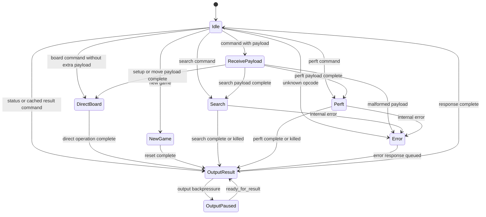

# Engine (`engine`)

Status: implemented V1 protocol FSM; search-controller integration is stubbed.

The engine module is the byte-command layer between RX/TX stream wrappers and the search controller. It parses fixed-size command payloads, owns engine-level protocol state, maintains active board state through the search controller direct-board path, and streams fixed-size responses.

The current RTL implements the protocol FSM and emits typed controller requests, but the real search controller is not implemented yet. Board-level builds connect this boundary to `search_controller_stub`, which acknowledges direct-board operations and returns deterministic placeholder search/perft results.

## Ports

| Direction | Port Name | Size | Description |
| --------- | --------- | ---- | ----------- |
| Input | `clk` | 1 | Engine clock. |
| Input | `rst_n` | 1 | Synchronous active-low reset. |
| Input | `data_in` | 8 | Command or payload byte from RX decode. |
| Input | `data_in_valid` | 1 | Indicates `data_in` is valid. |
| Input | `kill` | 1 | Asynchronous request to stop the current search. |
| Input | `ready_for_result` | 1 | Indicates the downstream output path can accept another result byte. |
| Output | `error_flag` | 1 | Indicates the engine has detected a protocol or internal error. |
| Output | `ready` | 1 | Indicates the engine can accept the next command or payload byte for its current input state. |
| Output | `data_out` | 8 | Response byte. |
| Output | `data_out_valid` | 1 | Indicates `data_out` is valid. |
| Output | `search_req_valid` | 1 | Indicates `search_req` contains a valid direct-board, search, perft, new-game, or kill request. |
| Input | `search_req_ready` | 1 | Indicates the downstream controller accepted the current request. For direct-board requests, acceptance means the operation is committed or strictly ordered before any later accepted request. |
| Output | `search_req` | `EngineControllerRequest` | Typed controller request defined in `engine_defs`. |
| Input | `search_resp_valid` | 1 | Indicates `search_resp` contains a completed search/perft result or controller error. |
| Input | `search_resp` | `EngineControllerResponse` | Typed controller response defined in `engine_defs`. |

## Commands

The engine command byte and payload formats are defined in [laptop-fpga-communication.md](../protocols/laptop-fpga-communication.md). The engine assumes command payloads are legal chess commands because the Python host validates UCI input before encoding FPGA commands.

The external protocol should expose `Set board` as a single fixed-size command. The engine may decompose it into multiple direct-board operations internally; this keeps host setup atomic and avoids command-stream overhead from 64 separate tile writes.

V1 validates protocol shape only: unknown opcodes, reserved move bits, reserved `FullBoard` bits, and `SPARE_PIECE` tile encodings are rejected. The host remains responsible for chess legality.

## States

| State | Description |
| ----- | ----------- |
| Idle | Engine is awaiting a command byte. |
| Receive Payload | Engine is collecting the fixed-size payload for the current command. |
| Direct Board | Engine is applying setup, make-move, or undo-move operations through the search controller direct-board path. |
| New Game | Engine is clearing game/search state and resetting the active board to the normal starting position. |
| Search | Engine has started a search and waits for completion, kill, or error. |
| Perft | Engine has started a perft operation and waits for completion, kill, or error. |
| Output Result | Engine is streaming a response one byte at a time. |
| Output Paused | Engine has response bytes pending but `ready_for_result` is deasserted. |
| Error | Engine detected a malformed command, unsupported opcode, or internal error and will emit an error response. |

## Registers

| Register Name | Size | Description |
| ------------- | ---- | ----------- |
| `state` | Enum | Current engine FSM state. |
| `curr_opcode` | 8 | Command currently being processed. |
| `payload_count` | Small counter | Number of payload bytes received for the current command. |
| `payload_shift` | Command-dependent | Temporary storage for the current command payload. |
| `wtime` | `TIME_BITS` | White clock time in milliseconds. |
| `btime` | `TIME_BITS` | Black clock time in milliseconds. |
| `winc` | `TIME_BITS` | White increment in milliseconds. |
| `binc` | `TIME_BITS` | Black increment in milliseconds. |
| `depth_limit` | `PlyIndex` or wider command field | Maximum search depth. |
| `node_limit` | `NODE_COUNT_BITS` | Maximum node count. |
| `time_limit` | `TIME_BITS` | Fixed search duration. |
| `last_score` | `EvalScore` | Score from the most recent completed search. |
| `last_move` | `Move` | Best move from the most recent completed search. |
| `last_node_count` | `NODE_COUNT_BITS` | Node count from the most recent completed search. |

## New Game Semantics

The New Game command follows UCI `ucinewgame` semantics. It clears active search state, per-thread stacks, TT contents or TT generation validity, repetition/history state, latched errors, pending responses, and any command FIFO contents that can be safely discarded. It also resets the active board to the normal chess starting position.

## Current RTL Notes

`Set board` is decomposed into 68 direct-board requests: 64 tile writes followed by castling permissions, en passant state, side to move, and halfmove clock. `Make move` and `Undo move` emit single direct-board requests. The engine sends an ACK after the final direct-board request is accepted, so the controller must treat accepted direct-board requests as committed or strictly ordered before any later accepted search request.

Search and perft commands wait for a controller response, latch the result, and stream the documented response format. While waiting for search/perft, the engine accepts only in-band Kill (`0x1f`) as a command byte. Any other byte is rejected as malformed protocol input.

## Child Modules

- [`search_controller`](search-controller.md), currently represented in board builds by `search_controller_stub`.
