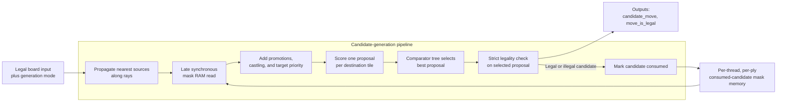

# Move Generator (`move_generator`)

Status: tiled pipeline implementation in progress. Standalone move-generation coverage passes, while same-ply node-mask reuse in `search_controller` integration is still being corrected.

The move generator accepts a legal input position and emits one ordered candidate move per dispatch. It also reports whether the candidate is strictly legal. A candidate is consumed for the current node whether or not it is legal.

## Ports

| Direction | Port Name | Description |
| --------- | --------- | ----------- |
| Input | `clk` | Clock. |
| Input | `rst_n` | Synchronous active-low reset. |
| Input | `move_gen_op` | Move-generation operation. |
| Input | `start_node` | Assert with the first generation request for a new search node to clear that node's consumed-candidate mask. |
| Input | `thread_id` | Thread whose per-node searched-move mask should be read or written. |
| Input | `ply` | Current search ply. |
| Input | `board_tiles` | 64 x 4-bit tiles. |
| Input | `turn` | Side to move. |
| Input | `castle_perms` | Castling permissions. |
| Input | `has_ep` | Whether the position has an en passant target. |
| Input | `ep_file` | En passant file if `has_ep` is asserted. |
| Input | `target_move` | Move that should receive highest priority if legal and unsearched. |
| Output | `candidate_move` | Next ordered candidate move, or `NULL_MOVE` if no remaining candidate exists. |
| Output | `move_is_legal` | Asserted when `candidate_move` is strictly legal. If deasserted, the candidate is still consumed. |

## Operations

| Operation | Inputs Required | Description |
| --------- | --------------- | ----------- |
| Idle | None | Does not update internal move masks. |
| Normal Generation | None | Generates the next ordered candidate move. |
| Targeted Generation | `target_move` | Returns `target_move` if legal and unsearched; otherwise returns the next ordered candidate. Promotion targets match on `promo_piece`; non-promotion targets ignore `promo_piece`. |
| QSearch Generation | None | Generates the next quiescence-search candidate, limited to captures and promotions. Checking non-captures are not generated for qsearch. |

## Pipeline

| Pipeline Stage | Description |
| -------------- | ----------- |
| 0 | Capture the request and board. Each destination receives the tile broadcast by its immediate neighbor in each on-board direction; off-board inputs are constant NULL rays. |
| 1-6 | Empty tiles forward adjacent ray messages and increment their distance, while occupied tiles block messages behind them, until every destination has its nearest source tile in all eight directions. The consumed-mask RAM read is issued late in this window so the selected node mask is available when proposals are formed. |
| 7 | Sixty-four destination-local processing elements register one proposal each using the propagated rays, statically connected knight sources, old attacker/defender exchange scoring, promotion variants, targeted priority, qsearch filtering, and only the consumed-mask bits belonging to that tile. A small dedicated proposal handles castling. |
| 8 | First registered comparator level reduces 64 tile proposals plus castling to 16 proposals. |
| 9 | Second registered comparator level reduces 16 proposals to four. |
| 10 | Final registered comparator level reduces four proposals to one. |
| 11 | Check strict legality on the selected proposal using a virtual-board king attack test, update the consumed mask, and register the result before the external output boundary. |

## Ordered Move Generation

The current ordering scores destination-tile proposals for the requested node and selects the highest score. Each destination considers the nearest piece on each ray, legal knight sources, pawn forward/capture lanes, promotion variants, and castling candidates. Captures, en passant, promotions, castling, moving-piece type, and targeted moves receive ordering bonuses; exact ordering is an implementation detail as long as candidates are emitted once and target moves outrank other candidates when legal and unsearched.

Targeted Generation supports TT move ordering and root move forcing. If the target move is legal and unsearched, it must outrank all other candidates for that dispatch.

Promotion ordering emits queen, knight, rook, and bishop promotion identities separately, with queen promotions preferred first.

## Move Mask Memory

Each generated candidate must be marked as searched for the current `thread_id` and `ply`, even when `move_is_legal` is false. This prevents repeated emission of the same illegal pseudo-move.

The consumed-candidate mask is area-conscious rather than a full `from/to` matrix. It stores 378 directional board-edge bits for ordinary non-promotion candidates, 88 side-relative exact promotion bits for 22 promotion edges times four promotion pieces, and two side-relative exact castling bits. The total mask width is 468 bits per `thread_id`/`ply` node state.

The mask state is stored in a synchronous-read block-RAM template rather than in pipeline registers. The read address is issued shortly before proposal generation, and the loaded mask is carried only through proposal reduction so the selected candidate can set one bit and write the updated mask back to RAM. A `start_node` request bypasses the RAM read data with an all-zero mask for that request.

The compressed ordinary edge identity relies on the fixed-board nearest-piece property: for a given destination/direction edge, path blockers leave at most one pseudo-legal ordinary source that can consume that edge in the current node. Promotions and castling are exceptions because their candidate identity is not represented safely by a single ordinary edge, so they have exact dedicated bits.

The search controller must assert `start_node` with the first request for every new node, including same-ply sibling nodes. Reusing a `thread_id` and `ply` without `start_node` continues consuming candidates from the existing node mask.

## Legality Filtering

The input position is assumed legal. The move generator is responsible for rejecting generated candidates that would leave the side to move in check.

Legality filtering must cover:

| Case | Required Behavior |
| ---- | ----------------- |
| Pinned piece | A pinned piece may move only along the pin line when that preserves king safety. |
| King move | A king may not move to an attacked square. |
| Check | If in check, non-king moves must capture the checker, block the checking line, or otherwise remove the check. |
| Double check | Only king moves can be legal. |
| En passant | En passant must reject discovered checks created by removing the captured pawn. |
| Castling | Castling requires clear path squares, castling permission, king not currently in check, and king transit/destination squares not attacked. |

The board update pipeline should not select replacement moves after an illegal candidate is rejected; the search controller should dispatch move generation again.

## Current RTL Notes

The current RTL lives under `hardware/rtl/move_generator/`.

The current RTL uses the 468-bit compressed per-node consumed-candidate mask and supports normal, targeted, and qsearch generation, including en passant, castling, and all promotion variants. A ray message contains only the nearest source `Tile` and its three-bit distance; a NULL piece type represents an empty ray, and the source position is reconstructed from destination, direction, and distance. Seven registered propagation stages carry these messages between adjacent tiles. Sixty-four `move_generator_tile_PE` instances each consume only local ray data, statically connected knight sources, request controls, and the relevant consumed-mask bits from the late RAM read, then emit one packed proposal. Attacker and defender counts used only by the ordering heuristic are three bits and may wrap in unusually crowded positions. A three-level registered comparator tree selects one proposal, and a dedicated low-area path contributes castling. Strict legality is checked only for the selected candidate by applying the move virtually and testing the moving side's king for attack; castling additionally checks the origin and transit squares.

Current synthesis note: the previous RTL selected candidates through board-wide combinational tasks that accepted complete unpacked board and ray arrays. The current RTL restores explicit destination-local processing elements, compact ray records, localized mask inputs, and a registered reduction tree so synthesis tools elaborate repeated bounded modules instead of duplicating board-wide enumeration.

Current integration note: standalone generation exhausts each tested node without duplicate mask identities, but the search-controller perft test currently re-emits candidates when recycling a ply across sibling nodes. The remaining work is in the pipelined `start_node` and consumed-mask state handoff, not pseudo-legal generation or strict legality.
