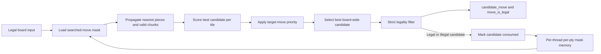

# Move Generator (`move_generator`)

Status: implemented and integrated with `search_controller`.

The move generator accepts a legal input position and emits one ordered candidate move per dispatch. It also reports whether the candidate is strictly legal. A candidate is consumed for the current node whether or not it is legal.

## Ports

| Direction | Port Name | Description |
| --------- | --------- | ----------- |
| Input | `clk` | Clock. |
| Input | `rst_n` | Synchronous active-low reset. |
| Input | `move_gen_op` | Move-generation operation. |
| Input | `start_node` | Assert with the first generation request for a new search node to clear that node's consumed-candidate mask. |
| Input | `thread_id` | Thread whose per-node searched-move mask should be read or written. |
| Input | `ply` | Current search ply. |
| Input | `board_tiles` | 64 x 4-bit tiles. |
| Input | `turn` | Side to move. |
| Input | `castle_perms` | Castling permissions. |
| Input | `has_ep` | Whether the position has an en passant target. |
| Input | `ep_file` | En passant file if `has_ep` is asserted. |
| Input | `target_move` | Move that should receive highest priority if legal and unsearched. |
| Output | `candidate_move` | Next ordered candidate move, or `NULL_MOVE` if no remaining candidate exists. |
| Output | `move_is_legal` | Asserted when `candidate_move` is strictly legal. If deasserted, the candidate is still consumed. |

## Operations

| Operation | Inputs Required | Description |
| --------- | --------------- | ----------- |
| Idle | None | Does not update internal move masks. |
| Normal Generation | None | Generates the next ordered candidate move. |
| Targeted Generation | `target_move` | Returns `target_move` if legal and unsearched; otherwise returns the next ordered candidate. Promotion targets match on `promo_piece`; non-promotion targets ignore `promo_piece`. |
| QSearch Generation | None | Generates the next quiescence-search candidate, limited to captures and promotions. Checking non-captures are not generated for qsearch. |

## Pipeline

| Pipeline Stage | Description |
| -------------- | ----------- |
| 0 | Select the best remaining pseudo-legal candidate for the request, check strict legality, and update the consumed-candidate mask for the node. |
| 1-10 | Pipeline the selected candidate, legality flag, and request metadata to the output stage. |

## Ordered Move Generation

The current ordering scores all remaining pseudo-legal candidate identities for the requested node and selects the highest score. Captures, en passant, promotions, castling, and targeted moves receive ordering bonuses; exact ordering is an implementation detail as long as candidates are emitted once and target moves outrank other candidates when legal and unsearched.

Targeted Generation supports TT move ordering and root move forcing. If the target move is legal and unsearched, it must outrank all other candidates for that dispatch.

Promotion ordering emits queen, knight, rook, and bishop promotion identities separately, with queen promotions preferred first.

## Move Mask Memory

Each generated candidate must be marked as searched for the current `thread_id` and `ply`, even when `move_is_legal` is false. This prevents repeated emission of the same illegal pseudo-move.

The consumed-candidate mask is area-conscious rather than a full `from/to` matrix. It stores 378 directional board-edge bits for ordinary non-promotion candidates, 176 exact promotion bits for 44 promotion edges times four promotion pieces, and four exact castling bits. The total mask width is 558 bits per `thread_id`/`ply` node state.

The compressed ordinary edge identity relies on the fixed-board nearest-piece property: for a given destination/direction edge, path blockers leave at most one pseudo-legal ordinary source that can consume that edge in the current node. Promotions and castling are exceptions because their candidate identity is not represented safely by a single ordinary edge, so they have exact dedicated bits.

The search controller must assert `start_node` with the first request for every new node, including same-ply sibling nodes. Reusing a `thread_id` and `ply` without `start_node` continues consuming candidates from the existing node mask.

## Legality Filtering

The input position is assumed legal. The move generator is responsible for rejecting generated candidates that would leave the side to move in check.

Legality filtering must cover:

| Case | Required Behavior |
| ---- | ----------------- |
| Pinned piece | A pinned piece may move only along the pin line when that preserves king safety. |
| King move | A king may not move to an attacked square. |
| Check | If in check, non-king moves must capture the checker, block the checking line, or otherwise remove the check. |
| Double check | Only king moves can be legal. |
| En passant | En passant must reject discovered checks created by removing the captured pawn. |
| Castling | Castling requires clear path squares, castling permission, king not currently in check, and king transit/destination squares not attacked. |

The board update pipeline should not select replacement moves after an illegal candidate is rejected; the search controller should dispatch move generation again.

## Current RTL Notes

The current RTL lives under `hardware/rtl/move_generator/`.

The current RTL uses the 558-bit compressed per-node consumed-candidate mask and supports normal, targeted, and qsearch generation, including en passant, castling, and all promotion variants. Strict legality is checked for the selected candidate without adding pipeline stages: non-king moves use king/check/pin constraints and only fall back to a virtual attack check for en passant x-rays, while king moves and castling transit squares still use virtual attack checks.
