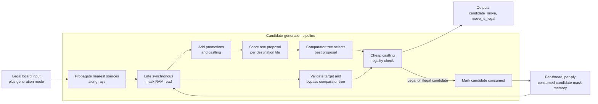

# Move Generator (`move_generator`)

The move generator accepts a legal input position and emits one ordered pseudo-legal candidate per dispatch. It cheaply rejects invalid castling paths, while ordinary king-safety legality is checked after the candidate is applied by the board-update path. A candidate is consumed for the current node whether or not it is later accepted.

## Ports

| Direction | Port Name | Description |
| --------- | --------- | ----------- |
| Input | `clk` | Clock. |
| Input | `rst_n` | Synchronous active-low reset. |
| Input | `move_gen_op` | Move-generation operation. |
| Input | `start_node` | Assert with the first generation request for a new search node to clear that node's consumed-candidate mask. |
| Input | `thread_id` | Thread whose per-node searched-move mask should be read or written. |
| Input | `ply` | Current search ply. |
| Input | `board_tiles` | 64 x 4-bit tiles. |
| Input | `turn` | Side to move. |
| Input | `castle_perms` | Castling permissions. |
| Input | `has_ep` | Whether the position has an en passant target. |
| Input | `ep_file` | En passant file if `has_ep` is asserted. |
| Input | `target_move` | Move that should receive highest priority if legal and unsearched. |
| Output | `candidate_move` | Next ordered candidate move, or `NULL_MOVE` if no remaining candidate exists. |
| Output | `move_is_legal` | Early legality indicator. Ordinary pseudo-legal moves assert it; castling deasserts it when the origin, transit, or destination is attacked. |

## Operations

| Operation | Inputs Required | Description |
| --------- | --------------- | ----------- |
| Idle | None | Does not update internal move masks. |
| Normal Generation | None | Generates the next ordered candidate move. |
| Targeted Generation | `target_move` | Returns `target_move` if legal and unsearched; otherwise returns the next ordered candidate. Promotion targets match on `promo_piece`; non-promotion targets ignore `promo_piece`. |
| QSearch Generation | None | Generates the next quiescence-search candidate, limited to captures and promotions. Checking non-captures are not generated for qsearch. |

## Pipeline

| Pipeline Stage | Description                                                                                                                                                                                                                                                                                                                                                                                                                                                                                   |
| -------------- | --------------------------------------------------------------------------------------------------------------------------------------------------------------------------------------------------------------------------------------------------------------------------------------------------------------------------------------------------------------------------------------------------------------------------------------------------------------------------------------------- |
| 0              | Capture the request and board. Destination/direction ray scans inspect their first one or two statically selected board squares; shorter scans remain constant NULL until their later start stage.                                                                                                                                                                                                                                                                                            |
| 1-3            | Each active destination-local ray scan inspects the next one or two successive squares from the matching delayed board copy until it finds the nearest occupied tile, then carries that result to stage 3. Geometry-specific start stages avoid storing short rays before they are needed while preserving request alignment and one-request-per-cycle throughput. The consumed-mask RAM read is issued late in this window so the selected node mask is available when proposals are formed. |
| 4              | Sixty-four destination-local processing elements register one proposal each using the propagated rays, statically connected knight sources, selective bounded SEE on the central 16 destinations, qsearch filtering, and only the consumed-mask bits belonging to that tile. Each PE first selects the highest-priority eligible source and constructs only that proposal; a separate fixed-order selector handles queen, knight, rook, and bishop promotions. Each PE compares a destination-free local proposal, and the fixed destination is added only at its output register. A narrow targeted-move result bypasses the ordinary proposal tree. A small dedicated proposal handles castling. |
| 5              | First registered comparator level reduces 64 tile proposals plus castling to eight proposals.                                                                                                                                                                                                                                                                                                                                                                                                 |
| 6              | Final registered comparator level reduces eight proposals to one.                                                                                                                                                                                                                                                                                                                                                                                                                             |
| 7              | Register the selected fixed-latency result and update the consumed mask.                                                                                                                                                                                                                                                                                                                                                                                                                       |

## Ordered Move Generation

The current ordering uses a five-bit unsigned `MoveScore` to score destination-tile proposals for the requested node and selects the highest score. Each destination considers the nearest piece on each ray, legal knight sources, pawn forward/capture lanes, promotion variants, and castling candidates. Queen promotions score 30; captures with SEE greater than or equal to zero score 16 plus victim piece type; knight, rook, and bishop promotions tie at 15; castling scores 13; negative-SEE captures score three plus victim piece type; and quiet moves score two. En passant uses pawn as its victim in both capture classes. Exact ordering among equal scores is deterministic but otherwise an implementation detail; valid unsearched targeted moves bypass SEE and the scorer.

The central 16 destination PEs perform bounded visible SEE from their eight nearest ray occupants and eight statically connected knight sources; other captures retain ordinary victim ordering to avoid replicating this relatively expensive logic in the other 48 PEs. Captures by a piece no more valuable than the victim pass immediately. Otherwise SEE removes the initiating attacker, finds the opponent's least valuable visible recapturer, and checks whether another visible friendly attacker can answer that recapture. An undefended recapture is losing; a defended exchange is nonnegative when the victim plus recapturer values cover the initiating attacker. The calculation uses coarse pawn/minor/rook/queen/king values of 1/3/5/9/15. It deliberately stops after the friendly defender reply and does not reveal a second rook, bishop, or queen behind a removed piece. The combinational classification is part of proposal formation, so the move-generator interface retains fixed latency and one-request-per-cycle throughput.

Targeted Generation supports TT move ordering and root move forcing. Each PE validates whether its selected target source can reach the requested destination, while a narrow valid/promotion/castling/safety result is reduced separately; a valid unsearched target bypasses the ordinary scored-proposal comparator tree.

Promotion ordering emits queen, knight, rook, and bishop promotion identities separately, with queen promotions preferred first.

## Move Mask Memory

Each generated candidate must be marked as searched for the current `thread_id` and `ply`, even when `move_is_legal` is false. This prevents repeated emission of the same illegal pseudo-move.

The consumed-candidate mask stores 588 bits for ordinary non-promotion candidates, comprising 420 directed sliding edges and 168 knight edges, plus 88 side-relative exact promotion bits for 22 promotion edges times four promotion pieces and two side-relative exact castling bits. Sliding edges must be directed because two same-color pieces can legally cross the same edge in opposite directions, such as `h2h4` and `h5h3`. The mask width is 678 bits per `thread_id`/`ply` node state.

The mask state is stored in a synchronous-read BRAM. The read address is issued shortly before proposal generation, and the loaded mask is carried only through proposal reduction. Proposals do not carry a redundant nine-bit mask index through the comparator tree; the selected move's index is reconstructed once at the mask update boundary. A `start_node` request bypasses the RAM read data with an all-zero mask for that request.

The search controller must assert `start_node` with the first request for every new node, including same-ply sibling nodes. Reusing a `thread_id` and `ply` without `start_node` continues consuming candidates from the existing node mask.

## Legality Filtering

The input position is assumed legal. The move generator performs pseudo-legal movement checks and rejects castling through check because the origin and transit conditions cannot be reconstructed from the final board alone. Ordinary candidates that expose or move the king into check are rejected after speculative board update.

Legality filtering must cover:

| Case         | Required Behavior                                                                                                                          |
| ------------ | ------------------------------------------------------------------------------------------------------------------------------------------ |
| Pinned piece | A pinned piece may move only along the pin line when that preserves king safety.                                                           |
| King move    | A king may not move to an attacked square.                                                                                                 |
| Check        | If in check, non-king moves must capture the checker, block the checking line, or otherwise remove the check.                              |
| Double check | Only king moves can be legal.                                                                                                              |
| En passant   | En passant must reject discovered checks created by removing the captured pawn.                                                            |
| Castling     | Castling requires clear path squares, castling permission, king not currently in check, and king transit/destination squares not attacked. |

The search controller ignores a speculative updated board when the moving king is attacked and dispatches move generation again. The board-update pipeline is stateless, so no reverse operation is required; the next push at the same ply overwrites the unused history entry.

## Current RTL Notes

A ray message contains only the nearest source `Tile` and its three-bit distance; a NULL piece type represents an empty ray, and the source position is reconstructed from destination, direction, and distance. Destination-local ray scans start at a geometry-specific point in the three-stage propagation window and inspect up to three statically selected squares from each matching delayed board copy, choosing the nearest occupied square, so every final ray remains aligned at stage 2 without storing short rays during earlier stages. Sixty-four `move_generator_tile_PE` instances each consume only local ray data, statically connected knight sources, request controls, and the relevant consumed-mask bits from the late RAM read. An ordinary-move eligibility scan selects the first source in fixed score order before constructing one packed destination-free proposal, and a four-bit promotion eligibility vector feeds a dedicated queen/knight/rook/bishop selector. Score zero encodes an invalid proposal, valid quiet moves use score two, and valid negative-SEE captures use scores four through nine according to victim type. Proposal sources use direction plus a three-bit encoded distance, with values zero through six denoting ray distance minus one and value seven denoting a knight source. The fixed destination is attached after each PE's local comparison, and the selected source position is reconstructed only after global reduction. Only the ten standard-chess castling origin, transit, and destination PEs instantiate enemy-attack output logic. A two-level registered comparator tree selects one ordinary proposal, while targeted generation carries only narrow validity and classification data beside the tree and selects the original requested move at the final boundary. A dedicated path contributes castling. The proposal's king-safety bit is a don't-care for ordinary moves and carries the castling result through the tree. Castling uses the same attack information for the origin, transit, and destination squares. Board, operation, castling, and en-passant payloads stop after proposal formation; only request identity, target, turn, compact proposals, target flags, and the consumed mask continue through reduction.

The current RTL uses the 678-bit per-node consumed-candidate mask and supports normal, targeted, and qsearch generation, including en passant, castling, and all promotion variants. Capture ordering uses the victim type without replicated attacker-value arithmetic; target moves bypass normal scoring, while promotions have dedicated higher scores. The PE array is the only ordinary-move pseudo-legality implementation. The ten PEs relevant to standard castling derive enemy attacks from the propagated nearest-piece rays and statically connected knight sources, including the slider exposed when a king vacates its origin. Pipeline payload and invalid-proposal fields are reset to don't-care values because the separately reset request-valid pipeline suppresses their use until valid request data has traversed the pipeline.
 
Current synthesis note: the previous RTL selected candidates through board-wide combinational tasks that accepted complete unpacked board and ray arrays. The current RTL restores explicit destination-local processing elements, compact ray records, localized mask inputs, and a registered reduction tree so synthesis tools elaborate repeated bounded modules instead of duplicating board-wide enumeration.
 
Current integration note: standalone generation exhausts each tested node without duplicate mask identities, and the search-controller perft regression passes when recycling a ply across sibling nodes with the pipelined `start_node` and consumed-mask state handoff.
