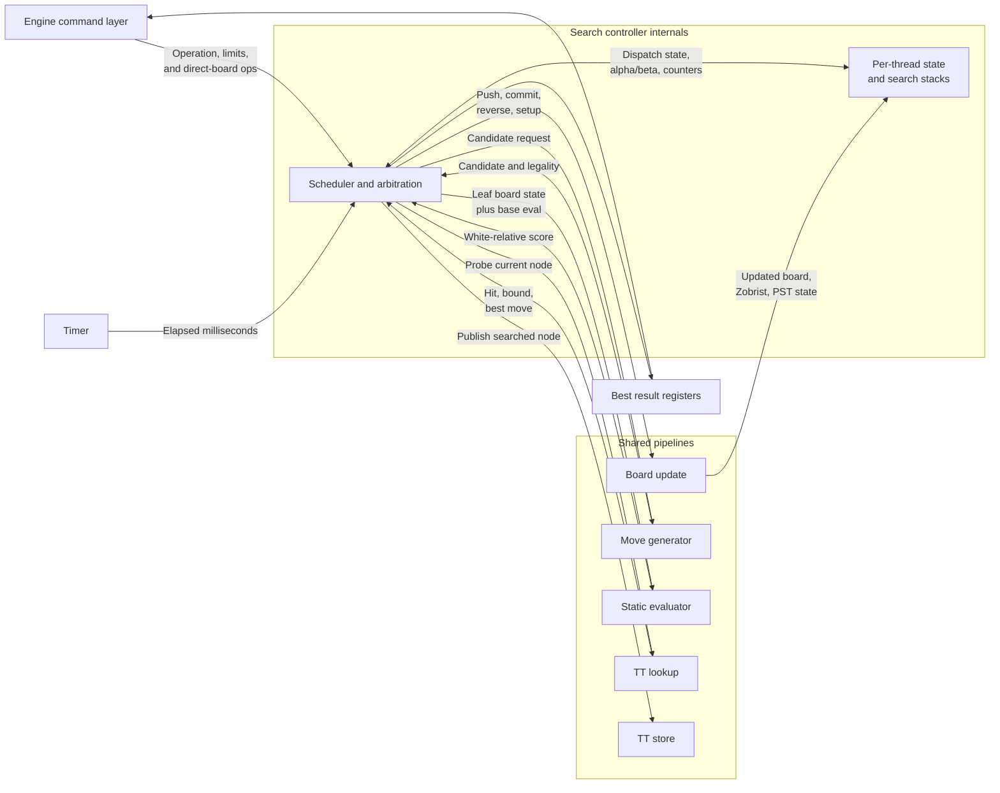

# Search Controller (`search_controller`)

## Current RTL Summary

`search_controller` owns active board state, applies direct-board operations through `board_update_pipeline`, maintains repetition history, clears the compact TT on New Game, initializes the normal starting position through board-update setup operations, runs generic stack-based perft through the real move generator, and runs iterative-deepening Lazy SMP PVS negamax with late-move reductions. Fixed-depth searches use a four-pawn aspiration margin around the previous completed score from depth two onward and repeat a failed aspiration pass once with the full window; timed and node-limited searches retain a full root window so retries cannot consume their deadline. The controller also uses board-update push/reverse operations, TT lookup/store cutoffs and move ordering, static-evaluator leaves, and qsearch captures and promotions after main-search depth reaches zero. Perft is serialized and borrows search context zero without modifying the active game board.

Search state is stored per configured thread for lifecycle status, scheduler phase, current board, Zobrist key, PST state, pipeline waits, alpha/beta values, repetition state, returns, and node counters. Full board states are not stored per ply. Per-node variables are packed into one synchronous block-RAM stack per thread, including actual remaining depth, an 8-bit saturating legal-move count, move-order phase, direct-move suppression state, eight bucket tops, and node/PVS/recovery flags. Each thread caches its current node in registers, writes that cache through to its current-ply RAM entry, and continuously prefetches the parent entry.

The LMR curve is `R = round(A + ln(d) * ln(m) / B)`, approximated with `ln(x) ~= ln(2) * floor(log2(x))` and a constant-folded bucket table. Unsigned Q8 parameters `LMR_A_Q8 = 192` and `LMR_B_Q8 = 614` encode `0.75` and approximately `2.4`; zero `LMR_B_Q8` is invalid. Only depth buckets reachable by the configured stack are generated, and entries use the native `SearchDepth` width; the default table ranges from one through six and needs three significant bits. Runtime logic registers the table result before board completion and clamps `R` to `0..d-1`. Non-root main-search moves are eligible at `d >= 3` and legal index `m >= 3`, including captures, promotions, checking moves, and evasions. Illegal candidates and re-searches do not advance `m`. Eligible children use depth `d - 1 - R` with the PVS scout window; every alpha-raising reduced scout, including an apparent beta cutoff, repeats the move at depth `d - 1` with the full parent window. TT probe/store depth always follows the child's actual depth.

TT lookups keep only their issuing thread in `TT_WAIT` until the tagged memory response arrives. Stores are fire-and-forget: a thread enters `STORE_PUBLISH` only until the TT frontend consumes its request, then continues without waiting for memory completion. The block-RAM frontend FIFO defaults to 256 stores and drops overflow publications. A matching TT best move is retained for direct validation even when the stored depth is too shallow for its score or bound to cause a cutoff. Once attempted it is suppressed by exact encoded equality during ordinary generation even if board update rejects it. All search contexts share the TT: the primary thread orders the previous iteration's principal-variation move first at the root, while helper threads use normal position-dependent legal move ordering and diverge further through shared-TT timing and hits.

Board-update requests carry controller-local thread, operation, and ply tag shift registers so push and reverse completions restore or descend the tagged thread correctly. Move generation uses tagged ready/valid command and pop responses rather than a fixed-latency tag pipe. Static-evaluation requests retain controller-local thread tags, and TT requests carry `thread_id` in their records. The concurrent `ST_SEARCH_RUN` scheduler keeps root, child-return, TT-response, and per-pipeline dispatch cursors so independent ready threads can use different shared pipelines when more than one thread is configured.

Each main-search node advances through `DIRECT`, `GENERATE_NOISY`, `GOOD_NOISY`, `GENERATE_QUIET`, `QUIET`, `BAD_NOISY`, and `DONE`. Qsearch omits direct TT ordering and quiet generation. Perft uses the same noisy and quiet bucket path but drains both noisy ranges before quiets because ordering is irrelevant. A child inherits the parent's post-pop bucket tops, and returning restores the packed parent entry. Quiet beta cutoffs enqueue a positive shared-history update.

The search-time paths are: TT/root direct validation → board push → child search; noisy generation → good-noisy pop loop; quiet generation → quiet pop loop; bad-noisy pop loop; and terminal handling. A found pop or valid direct response feeds board update in the response cycle, eliminating the former response-to-issue bubble. Illegal results return directly to the current pop phase, legal results enter repetition/TT/evaluation/child search, and reverse completion restores the parent stack record. Move generation completes a whole class before its buckets become eligible, while independent bucket reads and generation writes may overlap across different threads.

Controller-level one-thread acceptance tests cover start-position perft depths 0, 1, and 2 plus direct-setup positions for kings-only, castling, en passant, promotion, stalemate, and checkmate. Search tests cover White and Black POV capture scoring, 50-move draw, stalemate draw, checkmate losing-mate terminal scores, node limit, fixed-time stop, clock-budget stop, oversized-depth errors, TT reuse, TT direct ordering, PVS, depth-4 LMR behavior, repetition, and Kill.

At the start of each root iteration, the controller initializes every `SEARCH_THREAD_COUNT` context as active and ready at the root position. The primary owns the reported iteration PV and score; helper results contribute through TT entries rather than overriding the main result. It handles kill during active work, bounds requested depth to the local stack, clears active repetition history on direct setup writes, cancels search pipeline wait, tag, and in-flight state on Kill, New Game, or search start, and scores 50-move and repetition draws plus checkmate and stalemate when no legal moves remain. Node and time stops report only fully completed iteration depth, but may return a legal root move whose child has fully returned from the deeper in-progress iteration when that result strictly improves on the completed score.

The capacity constants are singular: `THREAD_COUNT = 16` defines the supported thread-ID space and `MAX_PLY_COUNT = 64` defines the supported ply-index space. The controller parameters `SEARCH_THREAD_COUNT` and `SEARCH_STACK_DEPTH` select the number of those supported contexts actually instantiated; they default to the capacity values. The DE1-SoC target explicitly instantiates one search thread and 24 stack plies. Other defaults are `ACTIVE_REPETITION_DEPTH = 100`, `LMR_A_Q8 = 192`, `LMR_B_Q8 = 614`, and `ENABLE_SEARCH_STATS = 0`.

When `ENABLE_SEARCH_STATS` is set, 40-bit counters record TT lookups and hits, frontend TT-cache lookup probes and hits, cycles spent in each non-idle per-thread search phase, noisy and quiet generation, destinations, candidates, history lookups, generation cycles, per-bucket writes, and bucket high-water tops. Overflow count and packed sticky/bucket/thread identity are also exposed. The values are serialized byte-wise through the narrow addressed debug port only after the search. Disabled builds elaborate constant-zero optional counters while retaining overflow status.

The `quartus-de1-soc` synthesis target uses one search context and 24 allocated plies. The controller request contract is uniform: `req_ready` means the request was captured, and `resp_valid` means the operation is complete for direct-board, new-game, kill, perft, and search operations.

The search controller owns hardware search threads, the active board state visible to search, alpha/beta state, pipeline dispatch, and search-result selection.

## Operations

| Operation | Description |
| --------- | ----------- |
| Idle | Search controller is idle. Result ports hold the most recent completed search result. |
| Direct Board | Parent module applies a board operation directly. Used for setup, make move, and active-position maintenance. |
| Search Depth | Search current position to a fixed depth. |
| Search Fixed Time | Search until the fixed time limit expires. |
| Search on Clock | Search using clock and increment information from the engine layer. |
| Search Nodes | Search until a node limit is reached. |
| Perft | Count strictly legal moves to a fixed depth. Result is transmitted via node count. |
| Kill | Stop the current search as soon as pipeline state can be drained safely. |

## Ports

| Direction | Port Name | Size | Description |
| --------- | --------- | ---- | ----------- |
| Input | `clk` | 1 | Clock. |
| Input | `rst_n` | 1 | Synchronous active-low reset. |
| Input | `req_valid`, `req` | 1, `EngineControllerRequest` | Decoded direct-board, new-game, perft, search, or kill request. |
| Output | `req_ready` | 1 | The controller captured `req`. |
| Output | `resp_valid`, `resp` | 1, `EngineControllerResponse` | Completion and result for the captured request. |
| Input | `tt_memory_ready`, `tt_memory_error` | 1 each | Status from the selected TT backend. |
| Request/response | `tt_mem_*` | See `tt_defs.sv` | Vendor-neutral external TT memory command, write-data, read-data, and completion channels. |

## Score Convention

Search uses side-to-move point-of-view scores internally. Raw static evaluation and incremental PST/material state are White-relative, and the search controller converts them at leaf/static-eval boundaries based on the board side to move.

TT scores use the same side-to-move point-of-view convention as search. Mate scores must be adjusted by ply when stored or loaded so mate distance remains comparable.

## Required Child Pipelines

- [`board_update_pipeline`](board-update-pipeline.md)
- [`move_generator`](move-generator.md)
- [`static_evaluator`](static-evaluator.md)
- [`tt_lookup`](tt-lookup.md)
- [`tt_store`](tt-store.md)
- [`timer`](timer.md)

## Registers

| Register Name | Size | Description |
| ------------- | ---- | ----------- |
| `state` | Enum | Current search-controller FSM state. |
| `gen_search_stack_ram[].search_stack_mem` | Packed records | One synchronous block-RAM search stack per thread, containing moves, scores, bounds, repetition boundary, actual remaining depth, legal-move count, move-order state, direct suppression, eight bucket tops, and node/PVS flags. |
| `search_stack_top[THREAD_COUNT]` | Packed records | Register caches for each thread's current node. |
| `search_stack_parent_q[THREAD_COUNT]` | Packed records | Continuously prefetched synchronous-RAM parent values used on ascent. |
| `search_nodes` | `NODE_COUNT_BITS` | Search node count for the active operation; increments when a real legal move commits and enters its child position. Perft retains its conventional fixed-depth leaf count. |
| `search_thread_phase[THREAD_COUNT]` | Enum | Per-thread scheduler phase: ready, TT wait, eval wait, move wait, board wait, store publish, done, or idle. |
| `search_*_inflight[THREAD_COUNT]` | Bit arrays | Per-thread flags indicating accepted or pending board, move, eval, TT lookup, and TT store-publication work. Store publication retires on frontend acceptance. |
| `search_active_thread_count` | Count | Number of root-thread contexts still active in the current iterative-deepening pass. |
| `search_dispatch_cursor` | `ThreadID` | Round-robin cursor used to choose the next active ready thread context. |
| `search_return_dispatch_cursor` | `ThreadID` | Round-robin cursor used to choose the next thread with a pending child return to fold into its parent node. |
| `search_tt_response_dispatch_cursor` | `ThreadID` | Cursor used to choose among helper responses when no primary response is pending. |
| `search_*_dispatch_cursor` | `ThreadID` | Per-pipeline cursors used to choose among helpers after ready primary work has been preferred. |
| `search_*_tag_pipe` | Thread, operation, ply, and check-state tag arrays | Controller-local fixed-latency tags for board-update and static-evaluation completions; move generation instead returns explicit thread/ply tags on its variable-latency response. |
| `repetition_checker.active_history` | 100-entry 64-bit key RAM | Active-game reversible positions used to construct the shared checker’s parity-addressed static table before a search. The current root sample is excluded from previous-occurrence counts. |
| `repetition_checker` | Shared two-stage pipeline | Performs full-key static and per-thread line-history lookup with one request accepted per cycle, saturated occurrence reduction, irreversible-boundary masking, and tagged responses. |
| `repetition_checker.line_bank[]` | Banked 64-bit key RAM | Search-line history owned by the shared checker; stale entries are excluded by request-time ply and irreversible-boundary masks rather than cleared. |
