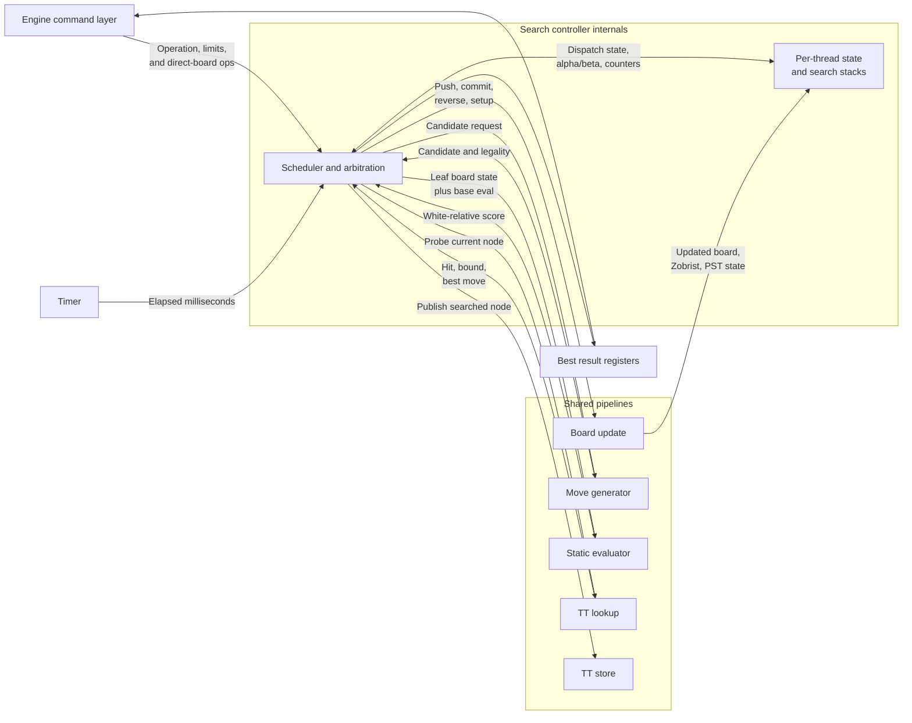

# Search Controller (`search_controller`)

## Current RTL Summary

`search_controller` owns active board state, applies direct-board operations through `board_update_pipeline`, maintains repetition history, clears the compact TT on New Game, initializes the normal starting position through board-update setup operations, runs generic stack-based perft through the real move generator, and runs iterative-deepening Lazy SMP PVS negamax. It uses board-update push/reverse operations, TT lookup/store cutoffs and move ordering, static-evaluator leaves, and qsearch captures and promotions after nominal depth. The first legal main-search child receives the full alpha/beta window; later children receive a null window and are pushed again with the full window after a non-cutting fail-high. Perft is serialized and borrows search context zero without modifying the active game board.

Search state is stored per configured thread for lifecycle status, scheduler phase, current board, Zobrist key, PST state, board, move, eval, and TT wait counters, in-flight flags, TT response pending records, move stacks, alpha/beta values, repetition line state, return values, current best moves, completed results, completed depths, and node counters. Full board states are not stored per ply. The 117-bit per-node search variables are packed into one synchronous block-RAM stack per thread. Each thread caches its current node in registers, writes that cache through to its current-ply RAM entry, and continuously prefetches the parent entry. Descents construct the child directly in the cache, while the board-reverse pipeline hides the synchronous parent-read latency before ascent completes.

TT lookups and stores keep only their issuing thread in `TT_WAIT` or `STORE_WAIT` until the tagged memory completion arrives. Other active threads remain schedulable while an off-chip request is pending. All search contexts share the TT: the primary thread orders the previous iteration's principal-variation move first at the root, while helper threads use normal position-dependent legal move ordering and diverge further through shared-TT timing and hits. Shared pipeline arbitration prefers ready primary work, allowing helpers to fill primary stalls without taking a resource from it.

Board-update requests carry controller-local thread, operation, and ply tag shift registers so push and reverse completions restore or descend the tagged thread correctly. Move-generation and static-evaluation requests carry controller-local thread tags. TT requests carry `thread_id` in the request and response records. The concurrent `ST_SEARCH_RUN` scheduler keeps root, child-return, TT-response, and per-pipeline dispatch cursors so independent ready threads can be issued into different shared pipelines when more than one thread is configured. The primary thread wins arbitration when it is ready; otherwise cursors choose among helpers. Accepted TT lookup responses are captured per thread, child returns are folded only after reverse-board completion, and deferred `STORE_WAIT` TT stores are retried after higher-priority progress work.

Controller-level perft tests cover start-position depths 0, 1, and 2 plus direct-setup positions for kings-only, castling, en passant, promotion, stalemate, and checkmate. Search tests cover White and Black POV capture scoring, 50-move draw, stalemate draw, checkmate losing-mate terminal scores, node limit, fixed-time stop, clock-budget stop, oversized-depth errors, TT reuse, all-thread root scheduling, overlapping move-generator requests, and overlap between different tagged pipelines.

At the start of each root iteration, the controller initializes every `SEARCH_THREAD_COUNT` context as active and ready at the root position. The primary owns the reported iteration PV and score; helper results contribute through TT entries rather than overriding the main result. It handles kill during active work, bounds requested depth to the local stack, clears active repetition history on direct setup writes, cancels search pipeline wait, tag, and in-flight state on Kill, New Game, or search start, returns only fully completed iteration depth for node and time stops, and scores 50-move and repetition draws plus checkmate and stalemate when no legal moves remain.

The controller defaults are `SEARCH_THREAD_COUNT = THREAD_COUNT`, `SEARCH_STACK_DEPTH = MAX_PLY_COUNT`, and `ACTIVE_REPETITION_DEPTH = 100`. Perft, Zobrist/repetition handling, TT traffic, and incremental PST evaluation are always present.

The `quartus-de1-soc` synthesis target uses one search context and 16 allocated plies. The controller request contract is uniform: `req_ready` means the request was captured, and `resp_valid` means the operation is complete for direct-board, new-game, kill, perft, and search operations.

The search controller owns hardware search threads, the active board state visible to search, alpha/beta state, pipeline dispatch, and search-result selection.

## Operations

| Operation | Description |
| --------- | ----------- |
| Idle | Search controller is idle. Result ports hold the most recent completed search result. |
| Direct Board | Parent module applies a board operation directly. Used for setup, make move, and active-position maintenance. |
| Search Depth | Search current position to a fixed depth. |
| Search Fixed Time | Search until the fixed time limit expires. |
| Search on Clock | Search using clock and increment information from the engine layer. |
| Search Nodes | Search until a node limit is reached. |
| Perft | Count strictly legal moves to a fixed depth. Result is transmitted via node count. |
| Kill | Stop the current search as soon as pipeline state can be drained safely. |

## Ports

| Direction | Port Name | Size | Description |
| --------- | --------- | ---- | ----------- |
| Input | `clk` | 1 | Clock. |
| Input | `rst_n` | 1 | Synchronous active-low reset. |
| Input | `req_valid`, `req` | 1, `EngineControllerRequest` | Decoded direct-board, new-game, perft, search, or kill request. |
| Output | `req_ready` | 1 | The controller captured `req`. |
| Output | `resp_valid`, `resp` | 1, `EngineControllerResponse` | Completion and result for the captured request. |
| Input | `tt_memory_ready`, `tt_memory_error` | 1 each | Status from the selected TT backend. |
| Request/response | `tt_mem_*` | See `tt_defs.sv` | Vendor-neutral external TT memory command, write-data, read-data, and completion channels. |

## Score Convention

Search uses side-to-move point-of-view scores internally. Raw static evaluation and incremental PST/material state are White-relative, and the search controller converts them at leaf/static-eval boundaries based on the board side to move.

TT scores use the same side-to-move point-of-view convention as search. Mate scores must be adjusted by ply when stored or loaded so mate distance remains comparable.

## Required Child Pipelines

- [`board_update_pipeline`](board-update-pipeline.md)
- [`move_generator`](move-generator.md)
- [`static_evaluator`](static-evaluator.md)
- [`tt_lookup`](tt-lookup.md)
- [`tt_store`](tt-store.md)
- [`timer`](timer.md)

## Registers

| Register Name | Size | Description |
| ------------- | ---- | ----------- |
| `state` | Enum | Current search-controller FSM state. |
| `gen_search_stack_ram[].search_stack_mem` | Packed 117-bit records | One synchronous block-RAM search stack per thread, containing moves, scores, bounds, repetition boundary, and node/PVS flags. |
| `search_stack_top[THREAD_COUNT]` | Packed 117-bit records | Register caches for each thread's current node. |
| `search_stack_parent_q[THREAD_COUNT]` | Packed 117-bit records | Continuously prefetched synchronous-RAM parent values used on ascent. |
| `search_nodes` | `NODE_COUNT_BITS` | Node count for the active operation. |
| `search_thread_phase[THREAD_COUNT]` | Enum | Per-thread scheduler phase: ready, TT wait, eval wait, move wait, board wait, store wait, done, or idle. |
| `search_*_inflight[THREAD_COUNT]` | Bit arrays | Per-thread flags indicating accepted or pending board, move, eval, TT lookup, and TT store pipeline work. |
| `search_active_thread_count` | Count | Number of root-thread contexts still active in the current iterative-deepening pass. |
| `search_dispatch_cursor` | `ThreadID` | Round-robin cursor used to choose the next active ready thread context. |
| `search_return_dispatch_cursor` | `ThreadID` | Round-robin cursor used to choose the next thread with a pending child return to fold into its parent node. |
| `search_tt_response_dispatch_cursor` | `ThreadID` | Cursor used to choose among helper responses when no primary response is pending. |
| `search_*_dispatch_cursor` | `ThreadID` | Per-pipeline cursors used to choose among helpers after ready primary work has been preferred. |
| `search_*_tag_pipe` | Thread, operation, and ply tag arrays | Controller-local fixed-latency tags for board-update, move-generation, and static-evaluation completions. |
| `repetition_checker.active_history` | 100-entry 64-bit key RAM | Active-game reversible positions used to construct the shared checker’s two root-parity static tables before a search. The current root sample is excluded from previous-occurrence counts. |
| `repetition_checker` | Shared five-stage pipeline | Performs full-key static and per-thread line-history lookup with one request accepted per cycle, saturated occurrence reduction, irreversible-boundary masking, and tagged responses. |
| `repetition_checker.line_bank[]` | Banked 64-bit key RAM | Search-line history owned by the shared checker; stale entries are excluded by request-time ply and irreversible-boundary masks rather than cleared. |
