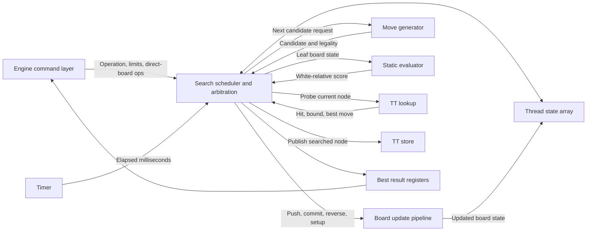

# Search Controller (`search_controller`)

Status: implemented current RTL contract.

Current RTL note: full RTL tests instantiate the real `search_controller`. It owns active board state, applies direct-board operations through `board_update_pipeline`, stores active-game repetition keys for draw detection when Zobrist hashing is enabled, clears the compact TT on New Game when TT is enabled, initializes the normal starting position through board-update setup operations, optionally runs generic stack-based perft through the real move generator with current-board push/reverse state, and runs iterative-deepening Lazy SMP negamax with board-update pushes and reverse moves, optional TT lookup/store cutoffs, targeted TT move ordering, static-evaluator leaves, and qsearch captures/promotions after nominal depth. Search state is stored per configured thread for lifecycle status, scheduler phase, current board/zobrist/PST state, board/move/eval pipeline wait counters, board/move/eval/TT in-flight flags, TT response pending records, move stacks, alpha/beta values, TT metadata, repetition line state, return values, current best moves, completed results, completed depths, and node counters; full board states are not stored per search ply, and per-thread/per-ply search stacks are represented as flat `SEARCH_THREAD_COUNT * SEARCH_STACK_DEPTH` arrays addressed by `search_stack_addr` so Quartus does not elaborate unpacked multidimensional stack arrays. Search board-update requests carry controller-local thread, operation, and ply tag shift registers so push and reverse completions restore or descend the tagged thread correctly, move-generation and static-evaluation requests carry controller-local thread tag shift registers, and TT requests carry `thread_id` in the request/response records. The concurrent `ST_SEARCH_RUN` scheduler keeps active-thread count, root dispatch cursor, child-return dispatch cursor, TT-response dispatch cursor, and per-pipeline dispatch cursors for board update, move generation, static evaluation, TT lookup, and TT store issue paths; it can issue independent ready threads into different shared pipelines in the same wall-clock interval when more than one thread is configured, continuously shifts tagged completion queues, captures TT lookup responses by thread, folds child returns by dispatcher selection after reverse-board completion, and retries deferred `STORE_WAIT` TT stores after higher-priority progress work. Controller-level perft tests cover start position depth 0, 1, and 2 plus direct-setup positions for kings-only, castling, en passant, promotion, stalemate, and checkmate, and search tests cover White and Black POV capture scoring, 50-move draw, stalemate draw, checkmate losing-mate terminal scores, node limit, fixed-time stop, clock-budget stop, oversized-depth errors, TT reuse, all-thread root scheduling, overlapping move-generator requests, and overlap between different tagged pipelines. At the start of each root iteration, the controller initializes every `SEARCH_THREAD_COUNT` thread context as active and ready at the root position, applies deterministic per-thread root move hints, shares TT when enabled, and selects the best same-depth result with a stable same-score move tie-break. It also handles kill during active work, bounds requested depth to the local stack, clears active repetition history on direct setup writes, cancels search pipeline wait/tag/in-flight state on Kill/New Game/search start, returns only fully completed iteration depth for node and time stops, and scores 50-move, repetition when Zobrist hashing is enabled, bare-king, one-minor, and same-color-bishop insufficient-material draws plus checkmate/stalemate when no legal moves remain. The controller defaults are `SEARCH_THREAD_COUNT = THREAD_COUNT`, `SEARCH_STACK_DEPTH = MAX_PLY_COUNT`, `ACTIVE_REPETITION_DEPTH = 256`, `ENABLE_PERFT = 1`, `ENABLE_ZOBRIST = 1`, `ENABLE_TT = 1`, and `ENABLE_PST = 1`. Current RTL note: the `quartus-de1-soc` synthesis target uses the real controller with one search context and eight allocated plies. The controller request contract is uniform: `req_ready` means the request was captured, and `resp_valid` means the operation is complete for direct-board, new-game, kill, perft, and search operations.

The search controller owns hardware search threads, the active board state visible to search, alpha/beta state, pipeline dispatch, and search-result selection.

## Operations

| Operation | Description |
| --------- | ----------- |
| Idle | Search controller is idle. Result ports hold the most recent completed search result. |
| Direct Board | Parent module applies a board operation directly. Used for setup, make move, and active-position maintenance. |
| Search Depth | Search current position to a fixed depth. |
| Search Fixed Time | Search until the fixed time limit expires. |
| Search on Clock | Search using clock and increment information from the engine layer. |
| Search Nodes | Search until a node limit is reached. |
| Perft | Count strictly legal moves to a fixed depth. Result is transmitted via node count. |
| Kill | Stop the current search as soon as pipeline state can be drained safely. |

## Ports

| Direction | Port Name | Size | Description |
| --------- | --------- | ---- | ----------- |
| Input | `clk` | 1 | Clock. |
| Input | `rst_n` | 1 | Synchronous active-low reset. |
| Input | `operation` | Enum | Operation for the search controller to start or continue. |
| Input | `direct_board_op` | `BoardOp` | Board operation to execute during Direct Board mode. |
| Input | `move_in` | `Move` | Move for Direct Board, root move hints, or legality/perft operations as needed. |
| Input | `board_wr_data` | 4 | Tile, turn, castle-perms, or en-passant data for direct board writes. |
| Input | `clock_time` | `TIME_BITS` | Time left on the clock for the side to move. |
| Input | `inc_time` | `TIME_BITS` | Increment for the side to move. |
| Input | `depth_limit` | Depth field | Maximum search depth. |
| Input | `node_limit` | `NODE_COUNT_BITS` | Maximum number of nodes to search. |
| Input | `time_limit` | `TIME_BITS` | Maximum fixed search duration. |
| Input | `kill` | 1 | Stops the current operation. |
| Output | `ready` | 1 | Indicates the current request was captured. Completion is reported separately with the response-valid signal. |
| Output | `board_rd_data` | 4 | Data read from direct board access. |
| Output | `score` | `EvalScore` | Best score from the most recent search, root side-to-move point-of-view. |
| Output | `move_out` | `Move` | Best move from the most recent search. |
| Output | `nodes_count` | `NODE_COUNT_BITS` | Number of nodes searched. |
| Output | `completed_depth` | Depth field | Deepest fully completed root iteration. |
| Output | `end_reason` | Enum | Reason the search stopped. |

## Score Convention

Search uses side-to-move point-of-view scores internally. Raw static evaluation and incremental PST/material state are White-relative, and the search controller converts them at leaf/static-eval boundaries based on the board side to move.

TT scores use the same side-to-move point-of-view convention as search. Mate scores must be adjusted by ply when stored or loaded so mate distance remains comparable.

## Required Child Pipelines

- [`board_update_pipeline`](board-update-pipeline.md)
- [`move_generator`](move-generator.md)
- [`static_evaluator`](static-evaluator.md)
- [`tt_lookup`](tt-lookup.md)
- [`tt_store`](tt-store.md)
- [`timer`](timer.md)

## Registers

| Register Name | Size | Description |
| ------------- | ---- | ----------- |
| `state` | Enum | Current search-controller FSM state. |
| `curr_operation` | Enum | Operation currently running. |
| `curr_depth` | Depth field | Current iterative-deepening depth. |
| `target_depth` | Depth field | Search depth limit. |
| `alpha[THREAD_COUNT][MAX_PLY_COUNT]` | `EvalScore` | Alpha stack values per thread. |
| `beta[THREAD_COUNT][MAX_PLY_COUNT]` | `EvalScore` | Beta stack values per thread. |
| `node_count[THREAD_COUNT]` | `NODE_COUNT_BITS` | Node count per thread. |
| `thread_state[THREAD_COUNT]` | Struct | Per-thread search state, current ply, wait state, and active board snapshot. |
| `search_thread_phase[THREAD_COUNT]` | Enum | Per-thread scheduler phase: ready, TT wait, eval wait, move wait, board wait, store wait, done, or idle. |
| `search_*_inflight[THREAD_COUNT]` | Bit arrays | Per-thread flags indicating accepted or pending board, move, eval, TT lookup, and TT store pipeline work. |
| `search_active_thread_count` | Count | Number of root-thread contexts still active in the current iterative-deepening pass. |
| `search_dispatch_cursor` | `ThreadID` | Round-robin cursor used to choose the next active ready thread context. |
| `search_return_dispatch_cursor` | `ThreadID` | Round-robin cursor used to choose the next thread with a pending child return to fold into its parent node. |
| `search_tt_response_dispatch_cursor` | `ThreadID` | Round-robin cursor used to choose the next thread with a captured TT lookup response to apply. |
| `search_*_dispatch_cursor` | `ThreadID` | Per-pipeline round-robin cursors for board update, move generation, static evaluation, TT lookup, and TT store issue paths. |
| `search_*_tag_pipe` | Thread, operation, and ply tag arrays | Controller-local fixed-latency tags for board-update, move-generation, and static-evaluation completions. |
| `game_repetition_history` | Hash array | Active-game reversible-position hashes since the last irreversible move. |
| `thread_repetition_history[THREAD_COUNT][MAX_PLY_COUNT]` | Hash array | Search-line hashes used to detect repetition inside each thread's current line. |
