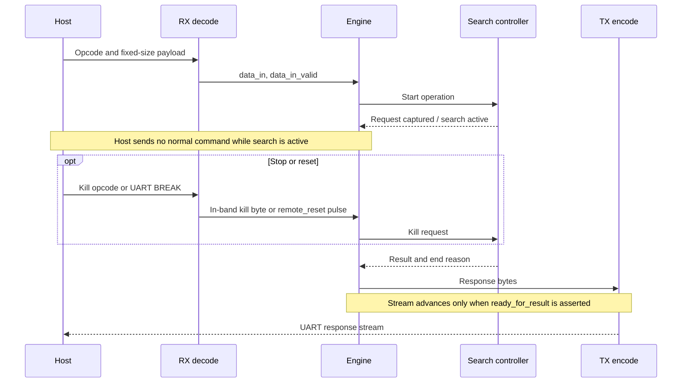

# Laptop-FPGA Communication

The host communicates with the FPGA as a single in-order byte stream. The host is responsible for UCI parsing, chess legality of incoming position and move commands, command serialization, and avoiding FIFO overflow.

The FPGA command protocol uses a command byte followed by an implicit fixed-size payload determined by the command. There is no request ID, payload length field, or checksum. This keeps RTL parsing small and deterministic; the host must not issue a second synchronous command until the previous command is complete or is explicitly killed.

## UART Configuration

| Setting | Value |
| ------- | ----- |
| Baud rate | 2,000,000 |
| Data bits | 8 |
| Parity | None |
| Stop bits | 1 |
| Byte order | Little-endian for multi-byte scalar fields |

## Command Stream Rules

Every command starts with one opcode byte. Payload bytes immediately follow the opcode and have the fixed size shown in the command table.

`data_in_valid` qualifies command and payload bytes. If the engine is waiting for a payload byte and `data_in_valid` is deasserted, the engine remains in its current input state until the next valid byte arrives.

The engine asserts `ready` when it can accept the next command byte. During fixed-size payload reception, `ready` may mean ready for the next payload byte rather than ready for a new command.

The host should send no normal command while the engine is searching. The expected mid-search communication is the in-band Kill command, UART BREAK for remote reset, or output-flow control.

## Commands

| Opcode | Command | Payload | Response |
| ------ | ------- | ------- | -------- |
| `0x00` | Get status | None | Status response. |
| `0x01` | Set board | `FullBoard` payload, 36 bytes | Ack/status response. |
| `0x02` | Make move | `Move`, 2 bytes | Ack/status response. |
| `0x04` | New game | None | Ack/status response. |
| `0x10` | Search depth | Depth, 1 byte | Search result when complete. |
| `0x11` | Search fixed time | `TimeType`, 3 bytes | Search result when complete. |
| `0x12` | Search on clock | `wtime`, `btime`, `winc`, `binc`; four `TimeType` values, 12 bytes total | Search result when complete. |
| `0x13` | Search nodes | `NodeCountType`, 5 bytes | Search result when complete. |
| `0x14` | Perft | Depth, 1 byte | Perft result when complete. |
| `0x1f` | Kill | None | Status response after search is stopped. |
| `0x20` | Get search result | None | Most recent search result. |

The command payload encodings are defined in [binary-encoding.md](binary-encoding.md).

Perft is an optional hardware command controlled by the engine/controller `ENABLE_PERFT` parameter. The generic RTL/test configuration enables it, and the current DE1-SoC synthesis target enables it through the real search controller.

`Set board` is the preferred way for the host to replace the active position. The engine may internally decompose that command into `board_update_pipeline` Set Tile, Set Turn, Set Castle Perms, Set En Passant, and Set Halfmove Clock operations, but the external protocol should not require the host to stream primitive board writes for normal UCI position setup.

`New game` follows UCI `ucinewgame` semantics. It clears search state, TT contents or TT generation validity, history used for repetition/draw handling, latched errors, pending responses, and command FIFOs where safe. It also resets the active board to the normal chess starting position.

Ack responses for Set Board, Make Move, and New Game are emitted only after the controller reports operation completion, not merely after request capture.

UART BREAK, defined as RX held low for at least 20 bit times, is the only out-of-band reset signal. Normal command bytes, including `0x1f` Kill, remain in the byte stream and must not be intercepted by RX decode because the same byte values may appear inside fixed-size payloads. In the current board wrapper, BREAK clears the RX FIFO and resets the engine-side command, search-controller, and TX path state.

## Responses

Every response starts with a response-type byte followed by a fixed-size payload determined by the response type.

| Response Type | Name | Payload |
| ------------- | ---- | ------- |
| `0x80` | Status | Status byte, error byte, active operation byte. |
| `0x81` | Ack | Status byte. |
| `0x82` | Search result | Best move, score, node count, completed depth, end reason. |
| `0x83` | Perft result | Node count and completed depth. |
| `0xff` | Error | Error byte and status byte. |

Search result payload:

| Field | Size | Encoding |
| ----- | ---- | -------- |
| Best move | 2 bytes | `Move`. |
| Score | 2 bytes | Signed little-endian `EvalScore`, side-to-move point-of-view at the searched root. |
| Node count | 5 bytes | `NodeCountType`. |
| Completed depth | 1 byte | Unsigned depth. |
| End reason | 1 byte | `0` normal, `1` depth limit, `2` time limit, `3` node limit, `4` killed, `5` error. |

Status byte bits:

| Bit | Meaning |
| --- | ------- |
| `0` | Engine ready for a new command. |
| `1` | Search active. |
| `2` | Output response pending. |
| `3` | Error latched. |
| `7:4` | Reserved zero. |

Error byte values:

| Value | Meaning |
| ----- | ------- |
| `0` | No error. |
| `1` | Unknown opcode. |
| `2` | Malformed payload or reserved bits were nonzero. |
| `3` | RX overflow. |
| `4` | UART framing error. |
| `5` | Internal engine error. |

## Backpressure

Engine output is valid only when `data_out_valid` is asserted. If the host-side output path cannot accept another byte, the engine pauses response streaming until `ready_for_result` is asserted again.

If the RX FIFO is full, normal incoming bytes may be dropped and RX overflow is latched. The host must avoid this by respecting `ready` and by not streaming commands faster than the FPGA can accept them. UART BREAK is still recognized as remote reset when the FIFO is full.
